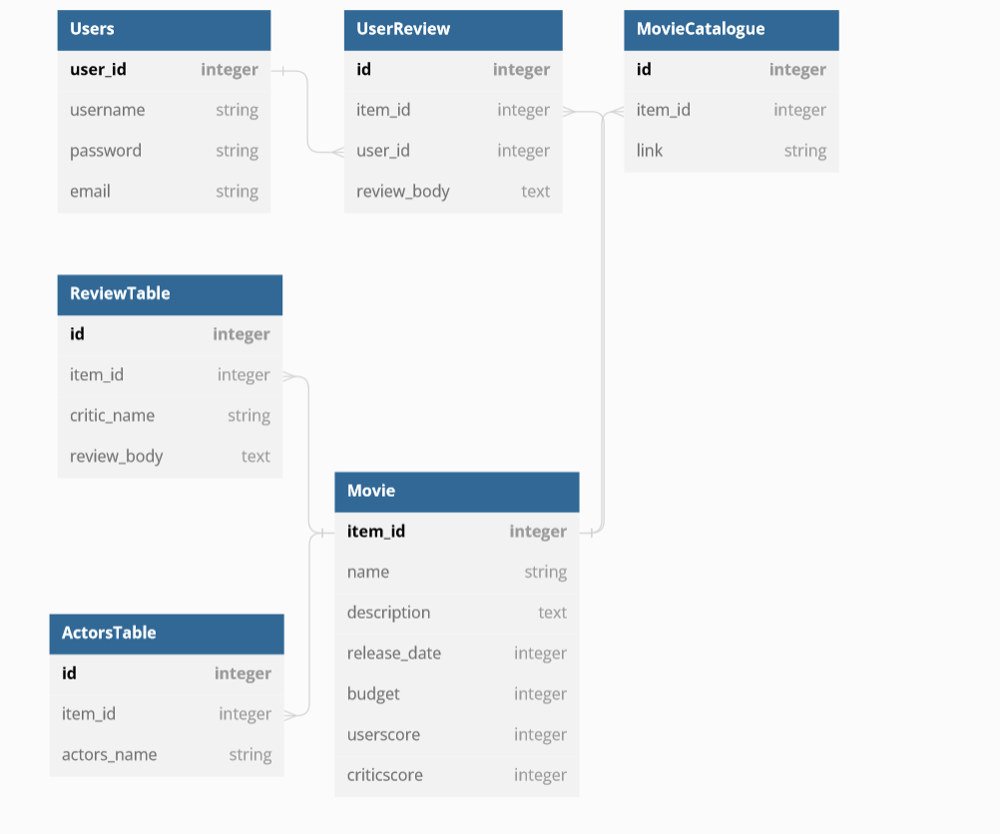

# НИЯУ МИФИ. ИИКС. Лабораторная работа №1-1. «Построение модели данных». Андрюнькин Захар, Б20-505. 2023.
## Обзор предметной области

Рассматриваемая предметная область - база данных фильмов. Имеется в виду веб-сайт, на котором можно будет узнать информацию по фильмам, посмотреть рецензии критиков и написать отзыв.
У каждого фильма есть название, год выпуска, бюджет, список актеры, пользовательский рейтинг и отзывы и средняя оценка критиков и их рецензии.

## Диаграмма сущностей

## Спецификация таблиц

### Movie

| Название Поля | Тип | Описание | Первичный ключ? | Внешний ключ? |
| --- | --- | --- | --- | --- |
| item_id | int | Идентификатор | да | нет |
| name | text | Название фильма | нет | нет |
| description | text | Аннотация к фильму | нет | нет |
| release_date | int | Дата выхода | нет | нет |
| budget | int | Бюджет фильма | нет | нет |
| userscore | int | Пользовательский рейтинг | нет | нет |
| criticscore | int | Оценка критиков | нет | нет |

### Users

| Название Поля | Тип | Описание | Первичный ключ? | Внешний ключ? |
| --- | --- | --- | --- | --- |
| user_id | int | Идентификатор | да | нет |
| username | string | Имя пользователя | нет | нет |
| password | string | Пароль пользователя | нет | нет |
| email | string | Электронная почта пользователя | нет | нет |

### UserReview

| Название Поля | Тип | Описание | Первичный ключ? | Внешний ключ? |
| --- | --- | --- | --- | --- |
| id | int | Идентификатор | да | нет |
| item_id | int | Идентификатор фильма | нет | Item.id |
| user_id | int | Идентификатор пользователя | нет | Users.user_id |
| review_body | text | Текст отзыва | нет | нет |

### MovieCatalogue

| Название Поля | Тип | Описание | Первичный ключ? | Внешний ключ? |
| --- | --- | --- | --- | --- |
| id | int | Идентификатор | да | нет |
| item_id | int | Идентификатор фильма | нет | Movie.item_id |
| link | string | Ссылка на фильм | нет | нет |

### ActorsTable

| Название Поля | Тип | Описание | Первичный ключ? | Внешний ключ? |
| --- | --- | --- | --- | --- |
| id | int | Идентификатор | да | нет |
| item_id | int | Идентификатор фильма | нет | Movie.item_id |
| actors_text | string | Имя актера | нет | нет |

### ReviewTable

| Название Поля | Тип | Описание | Первичный ключ? | Внешний ключ? |
| --- | --- | --- | --- | --- |
| id | int | Идентификатор | да | нет |
| item_id | int | Идентификатор фильма | нет | Movie.item_id |
| critic_name | string | Имя критика | нет | нет |
| review_body | text | Текст рецензии | нет | нет |

## Приложение
[SQL сценарий для создания таблиц в SQLite](./movie_catalogue.sql)

## Доказательство 3 нормальной формы

### Первая нормальная форма

Отношение находится в 1НФ, если все его атрибуты являются простыми, все используемые домены должны содержать только скалярные значения. Не должно быть повторений строк в таблице.

Доказательство: Для массивов элементов используются вспомогательные таблицы, строки не повторяются (везде есть первичный ключ, который уникален).

### Вторая нормальная форма

Отношение находится во 2НФ, если оно находится в 1НФ и каждый не ключевой атрибут неприводимо зависит от Первичного Ключа(ПК).

Неприводимость означает, что в составе потенциального ключа отсутствует меньшее подмножество атрибутов, от которого можно также вывести данную функциональную зависимость.

Доказательство: от `id` нельзя вывести функциональную зависимость, а составные первичные ключи выбраны так, что они единственным образом определяют объект, который описан данным ключом. Связка `id` + `something_id` также не позволяет вывести функциональную зависимость от себя.

### Третья нормальная форма

Отношение находится в 3НФ, когда находится во 2НФ и каждый не ключевой атрибут нетранзитивно зависит от первичного ключа. Проще говоря, второе правило требует выносить все не ключевые поля, содержимое которых может относиться к нескольким записям таблицы в отдельные таблицы.

Доказательство: все не ключевые поля, которые относят к нескольким записям (например, теги) вынесены в отдельную таблицу. Где нужно созданы вспомогательные таблицы (например, ItemTagsLink).

## Заключение
Была смоделирована структура базы данных для сайта с базой данных фильмов. Были описаны сущности, их атрибуты и связи между ними. Была построена диаграмма сущностей. Было доказано, что база данных находится в третьей нормальной форме. 
