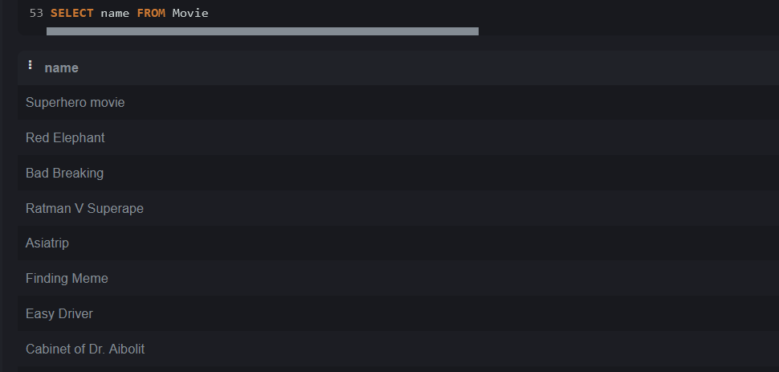
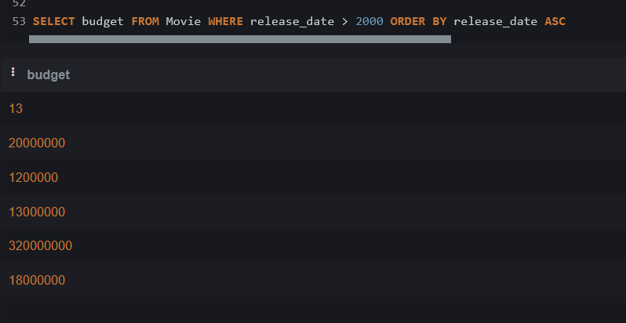
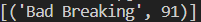
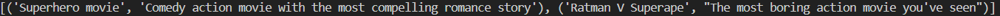
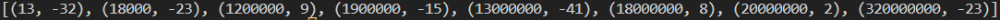

# НИЯУ МИФИ. ИИКС. Лабораторная работа №1-2. «Работа с данными. Простые запросы на выборку». Андрюнькин Захар, Б20-505. 2023.

## Список выполненных простых запросов SQL 

### Создание и заполнение таблиц
   Был выполнен [SQL сценарий для создания таблиц в SQLite](../lab1/movie_catalogue.sql). 

   Результат: созданы таблицы 
  
  Созданы тестовые записи в таблицах Item. 
  
  `INSERT INTO Movie (name, description, release_date, budget, criticscore, userscore) VALUES ("Superhero movie", "Comedy action movie with the most compelling romance story", 2008, 13000000, 86, 45);`
  
  `INSERT INTO Movie (name, description, release_date, budget, criticscore, userscore) VALUES ("Red Elephant", "Drama about hardships of prison life", 2001, 13, 67, 35);`
  
  `INSERT INTO Movie (name, description, release_date, budget, criticscore, userscore) VALUES ("Bad Breaking", "Bald guy cooking bad cookies in a critically acclaimed drama series", 2099, 18000000, 87, 95);`
  
  `INSERT INTO Movie (name, description, release_date, budget, criticscore, userscore) VALUES ("Ratman V Superape", "The most boring action movie you've seen", 2018, 320000000, 78, 55);`
  
  `INSERT INTO Movie (name, description, release_date, budget, criticscore, userscore) VALUES ("Asiatrip", "Friend group from Africa decides to go on a trip across Asian countries to meet one's true love in a typical teen comedy movie", 2005, 1200000, 64, 73);`

  `INSERT INTO Movie (name, description, release_date, budget, criticscore, userscore) VALUES ("Finding Meme", "Fish drama about father trying to find his lost son", 2004, 20000000, 87, 89);`

  `INSERT INTO Movie (name, description, release_date, budget, criticscore, userscore) VALUES ("Easy Driver", "Drama about two friends riding across the USA on a quest to find true freedom", 1965, 1900000, 88, 73);`

  `INSERT INTO Movie (name, description, release_date, budget, criticscore, userscore) VALUES ("Cabinet of Dr. Aibolit", "Strange murders happen in a small town after Dr. Aibolit arrived to a festival in a classic mystery movie", 1934, 18000, 96, 73);`

### Простые запросы на выборку
  1. Получить все названия фильмов из таблицы Movie. 

  2. Получить бюджеты фильмов, выпущенных после 2000, отсортированных по дате выхода. 

  3. Получить названия фильмов, отсортированных по пользовательскому рейтингу. 
  
  4. Получить названия фильмов и разницу между оценкой пользователей и критиков. 

  5. Получить название и среднюю оценку фильма с максимальной средней оценкой. 
  
  6. Получить название и аннотацию для фильма, в описании к которому содержится слово action. 
  
  7. Получить название, описание и среднюю оценку фильмов, в описании которых содержится слово drama и их средняя оценка выше 85. 

  8. Получить бюджет и разницу между оценкой критиков и пользователей, отсортированных по бюджету. 

## Заключение
База данных была заполнена тестовыми данными. На этих данных были выполнены простые запросы на выборку, которые могут понадобиться при работе данного магазина.

  
