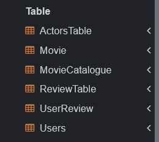
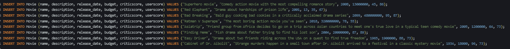
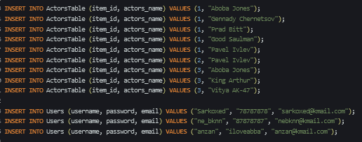
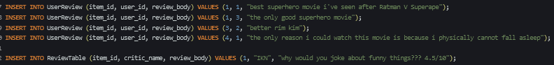
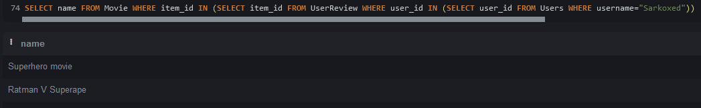
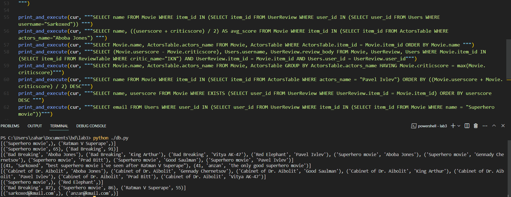

# НИЯУ МИФИ. ИИКС. Лабораторная работа №1-3. «Сложные запросы на выборку. Соединения». Андрюнькин Захар, Б20-505. 2023.

## Список выполненных запросов SQL 

### Создание и заполнение таблиц
   Был выполнен [SQL сценарий для создания таблиц в SQLite](./../lab1/movie_catalogue.sql). 

   Результат: созданы таблицы 
  
  Созданы тестовые записи в таблицах Movie, Users, UserReview, CriticReview, ActorsTable.   

### Сложные запросы на выборку
   1. Получить названия всех фильмов, под которыми оставил отзыв пользователь Sarkoxed. 

   2. Получить названия и среднюю оценку фильмов, в которых снимался Aboba Jones.

   3. Получить названия фильмов и имена актеров, снимавшихся в них.

   4. Получить разницу между оценками критиков и пользователей, имя пользователей и их отзыв для фильма, на который оставил рецензию критик IKN.

   5. Получить название фильма и имена актеров для фильма с самой высокой оценкой критиков.

   6. Получить названия фильмов, в которых снимался Pavel Ivlev, и отсортировать их в порядке убывания.

   7. Получить названия фильмов, для которых существуют пользовательские отзывы.

   8. Получить адреса электронной почты пользователей, которые оставили отзывы о фильме Superhero movie

   

## Заключение
База данных была заполнена тестовыми данными. На этих данных были выполнены сложные запросы на выборку, которые могут понадобиться при работе данного магазина.
